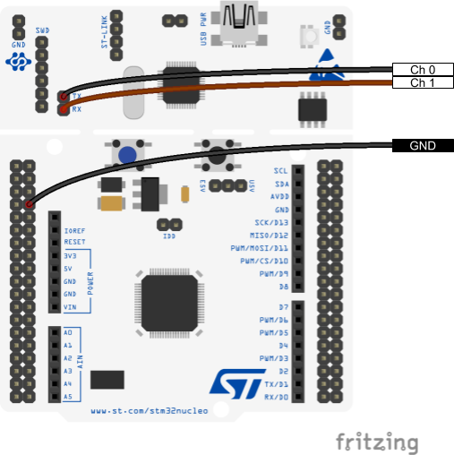

# How to Analyze UART

Universal Asynchronous Receiver/Transmitter \(UART\) is a fairly simple protocol with two lines \(transmit and receive\) going between two devices. The lines are normally held high until one of the devices wishes to communicate. At which point, the transmitting device pulls its transmit line low and sends out data with logic high being 1 and logic low being 0.

Example code is provided below for [Arduino](https://www.arduino.cc/), [mbed](https://os.mbed.com/), or [AC6 System Workbench for STM32 \(SW4STM32\)](http://www.openstm32.org/).

**Required Materials**

| Photo | Item |
| :--- | :--- |
| %%% | One of the Saleae logic analyzers: [Saleae Logic 8](https://usd.saleae.com/products/saleae-logic-8), [Saleae Logic Pro 8](https://usd.saleae.com/products/saleae-logic-pro-8), or [Saleae Logic Pro 16](https://usd.saleae.com/products/saleae-logic-pro-16)​ |
| %%% | ​[Nucleo-F446RE](https://www.digikey.com/product-detail/en/stmicroelectronics/NUCLEO-F446RE/497-15882-ND/5347712)​ |

#### Connect Hardware {#connect-hardware-2}

Note that on the Nucleo-F446RE, the UART lines used to communicate with the host computer are connected to the programming chip next to the USB connector. Arduino pins RX/D0 and TX/D1 are disconnected from these lines by default, which means we need to use the RX and TX pins near the programming chip.

Connect the GND wire to an available ground pin on the Nucleo. Connect Channel 0 to TX and connect Channel 1 to RX.

#### Run Demo Application {#run-demo-application-2}

Download the example code for your IDE:

* [UART Example - Arduino](http://localhost:4000/assets/code/uart_example_arduino.zip)
* [UART Example - mbed](http://localhost:4000/assets/code/uart_example_mbed.zip)
* [UART Example - SW4STM32](http://localhost:4000/assets/code/uart_example_sw4stm32.zip)

Open the demo in your chosen IDE. Compile the program, and upload it to the Nucleo-F446RE development board.

Download and open a serial terminal program. Here are some suggestions:

* Windows: [PuTTY](https://www.putty.org/), [Tera Term](https://ttssh2.osdn.jp/index.html.en)
* Mac: [Serial](https://decisivetactics.com/products/serial/), [CoolTerm](http://freeware.the-meiers.org/)
* Linux: [screen](https://www.gnu.org/software/screen/manual/screen.html), [Terminator](https://launchpad.net/terminator)

Connect to the Nucleo board over the assigned serial port with a baud rate of **115200**, 8 data bits, no parity bit, and 1 stop bit \(**8-N-1**\). Once you open the connection, anything you type should be echoed back to you.

#### Measure the Signal {#measure-the-signal-1}

Open the Logic software with the Logic Analyzer plugged in. Click on the **Device Settings Button**.

In the device settings window, set the speed to **at least 50 MS/s** and the duration to **1 second**. Click both **Clear** buttons to disable all channels, leaving only the digital channel 0 enabled. Click the **digital Channel 1** to enable it as well.

Click the **Device Settings Button** again to close the configuration window. With this setup, channel 0 is configured to capture UART data going from your computer to the Nucleo board \(TX on the Nucleo\), and channel 1 is configured to capture data from the Nucleo to your computer \(RX on the Nucleo\).

By default, triggering is set to occur on the rising edge of channel 0. UART is by default high, so we want to start capturing whenever the TX line drops low \(_start bit_\). Click the **Trigger Button** next to _Channel 0_ to bring up the _Trigger Settings_ pop-up. Select the **Trigger on Falling Edge** option.

Click on the **Trigger Button** again to close the pop-up. Click **Start**, and you should see the Logic software tell you that it is waiting for a trigger.

Back in your serial terminal program, type the letter ‘a’. The Logic software should begin capturing data and then show you the results.

Click on the plus button \(**+**\) next to _Analyzers_ on the right side of the Logic software. Select **Async Serial** to bring up the Serial settings window. Select **0 - ‘Channel 0’** for _Serial_, change the bit rate to **115200**, and leave the rest alone.

Repeat this process to add an additional analyzer, but set the channel to **1 - ‘Channel 1’**.

You should see two “Async Serial” bars appear under the _Analyzers_ pane. Additionally, the captured serial data should both have the letter ‘a’ over them. This shows that you captured the ASCII letter ‘a’ going from the computer to the Nucleo and the same letter being echoed back.

Try measuring the time it takes for your Nucleo to capture and echo a letter, and see if you can type a few more letters during the capture period and decode them.

